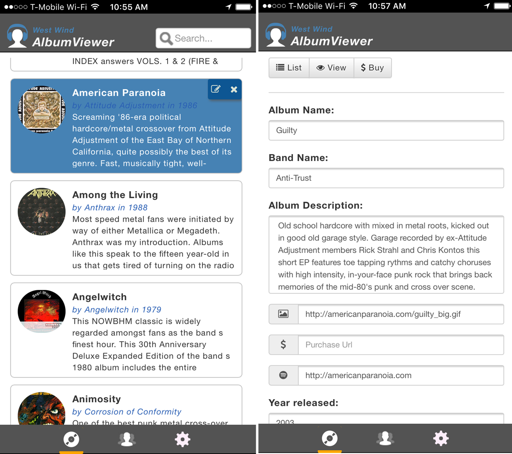

# West Wind Album Viewer ASP.NET Core Sample

**Sample Angular 2.0 application demonstrating ASP.NET Core API features**

This is a sample ASP.NET Core application that demonstrates basic features of ASP.NET Core in an API backend application with an Angular 2.0 frontend. The application allows browsing and editing of a list of albums and artists interactively.


In a Mobile Web Browser: 



**Online Sample:**
* [Live AlbumViewer Sample](https://samples.west-wind.com/AlbumViewerCore/)

### ASP.NET Core Features
The **ASP.NET Core** Backend demonstrates:

* Creating an API backend service
* Isolating business logic and Controller code
* Using a base Repository for business logic
* Separating code into separate projects
* Custom User Authentication
* CORS Support
* Using ASP.NET Core as a backend to an Angular 2.0 front end

The sample also includes a few Server Side Rendered MVC pages for browsing and viewing of albums and artists. I'll be adding the edit pages at a later point.

Version supported:  
* **.NET Core 1.1.0**
* **Visual Studio 2017 (.csproj)**
* **1.0.0-rc3-004530 SDK Version**

> #### Visual Studio 2015
> If you're using Visual Studio 2015, you need to use the `Last.NET1.01Version` Git tag to retrieve the last version that uses Visual Studio 2015 and the `.xproj`/`project.json` format. All newer builds use Visual Studio 2017 and the new `.csproj` style format.

### Angular 2.0 Features
The **Angular 2.0** front end application demonstrates:

* Page based Application
* Mobile friendly, adaptive UI
* Routing
* Animations and Page Transitions
* Client side and server side Authentication tracking
* Client side and server side Validation
* Managing Server Urls (dev/production)

The front end has been ported from an Angular 1.5 application, so it's not quite broken down into small control level components yet - a future refactor will address that.

Version supported:  
**Angular 2.1**


### Getting Started ###
You should just be able to clone this repo as is on either Windows or Mac (and probably Linux) and do:

```
cd <Base Solution Folder>
dotnet restore
cd .\src\AlbumViewerNetCore
dotnet run
```

Then navigate to [http://localhost:5000](http://localhost:5000) to start the application. First launch might fail due a timeout due to the initial DB creation, but subsequent requests should work.

If you're running the application locally through IIS or Kestrel, the application should just work as is. By default it uses a SqLite data base that is created in the Web app's content (not Web) root. 

The sample also works with SQL Server but you have to create the database for that to work and set the connection string in `appsettings.json`. 


To switch between SqLite and Sql Server use the `useSqlLite` configuration settings:

```json
  "Data": {
    "AlbumViewer": {
      "useSqLite": "true",
      "SqlServerConnectionString": "server=.;database=AlbumViewer;integrated security=true;",
    } 
  },
  //... other settings omitted
}
```  

In either case initial albums/artist data should auto-create the first time the app is run.

##### Using SqLite
SqLite will automatically create the database file in the content content root of the project (same folder as project.json). For this to work make sure that the account the Web application is running under has appropriate rights to create a new file and read/write to that file in the content folder.

##### Using Sql Server
To use Sql Server create a new empty database and then point the connection string at the new database. Make sure the account the Web server is running under has rights to create tables and then read/write data.

#### To develop the AlbumViewer Angular 2 example
The front end in the repo comes with pre-compiled .js files for the sample, so the application will just run through IIS Express/IIS or Kestrel.

Making changes to the Angular 2.0 application requires transpiling of the typescript source files. In order to make changes to the Angular 2 client sample run the following from a command window:

```
cd <installFolder>\src\AlbumViewerNetCore
npm install
npm run build
npm start
```

then navigate to **http://localhost:3000** to run the application. Note this uses the WebPack development server rather than through IIS Express or Kestrel.

Depending on which port you run the ASP.NET Core application you may have to change the API server base URL which defaults to **http://localhost:5000/** in the `app/business/appConfiguration.ts` file.

Once you've made your changes, you need to build the application's final output. Run:

```
npm run build:prod
```

or

```
webpack -p
```

which creates the final transpiled bundles you can use to run your application through the ASP.NET Core application.

#### Platforms 
Currently the app has been tested to run under Windows and Mac, but it should also work under Linux.

**License:**  
This sample is licensed under MIT license. Use, play with integrate code from
this repository as you see fit, at your own risk. This code is based on pre-release code and updated regularly to reflect the latest current builds.

**Warranty Disclaimer: No Warranty!**

IN NO EVENT SHALL THE AUTHOR, OR ANY OTHER PARTY WHO MAY MODIFY
AND/OR REDISTRIBUTE THIS PROGRAM AND DOCUMENTATION, BE LIABLE 
FOR ANY COMMERCIAL, SPECIAL, INCIDENTAL, OR CONSEQUENTIAL DAMAGES
ARISING OUT OF THE USE OR INABILITY TO USE THE PROGRAM INCLUDING, 
BUT NOT LIMITED TO, LOSS OF DATA OR DATA BEING RENDERED INACCURATE
OR LOSSES SUSTAINED BY YOU OR LOSSES SUSTAINED BY THIRD PARTIES OR
A FAILURE OF THE PROGRAM TO OPERATE WITH ANY OTHER PROGRAMS, EVEN
IF YOU OR OTHER PARTIES HAVE BEEN ADVISED OF THE POSSIBILITY OF 
SUCH DAMAGES.

<!-- Post Configuration -->
<!--
```xml
<blogpost>
<title>West Wind Album Viewer ASP.NET Core Sample</title>
<abstract>

</abstract>
<categories>

</categories>
<keywords>

</keywords>
<isDraft>False</isDraft>
<featuredImage>http://west-wind.com/wconnect/weblog/imageContent/2017/AlbumViewerVNext/AlbumViewer.png</featuredImage>
<weblogs>
<postid>926</postid>
<weblog>
Web Connection Weblog
</weblog>
</weblogs>
</blogpost>
```
-->
<!-- End Post Configuration -->