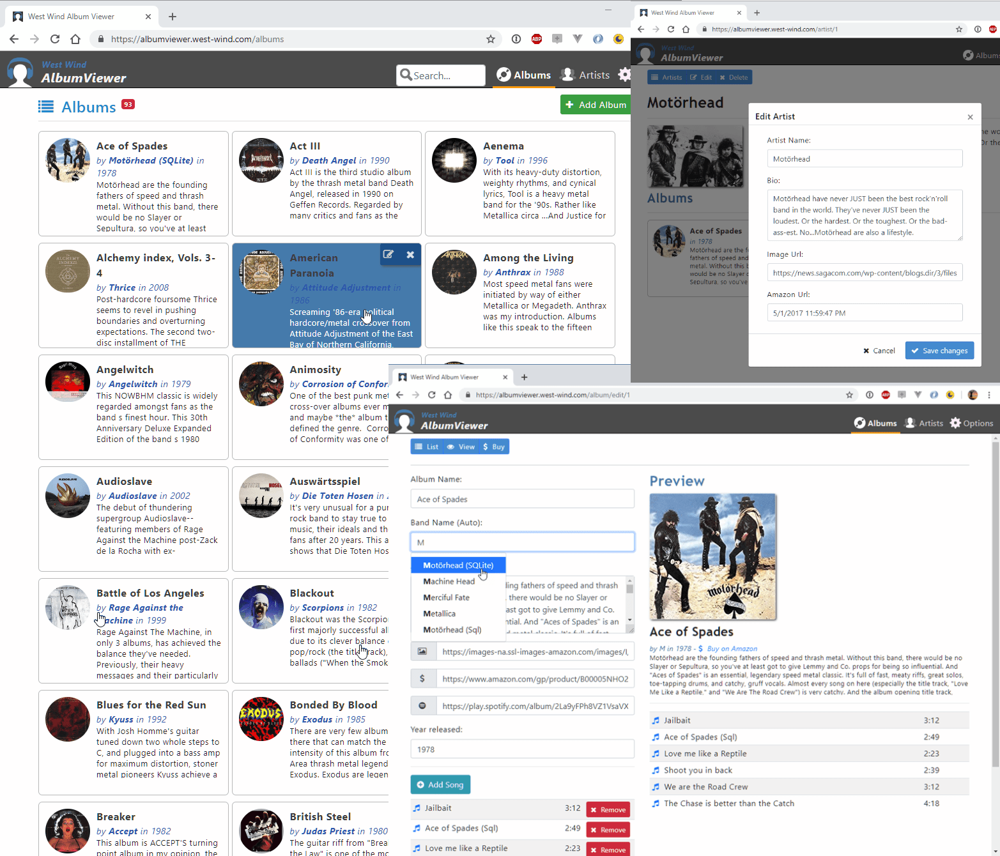

# West Wind Album Viewer ASP.NET 5 Sample
**Sample SPA application demonstrating ASP.NET Core features**

This is the sample code for the Album Viewer sample application from the 
CoDe Magazine Article *A First Look at ASP.NET vNext* (Jan 2015) and various ASP.NET Core blog posts from Rick Strahl's Web Log. This code has changed drastically since the article was published and has been updated to the latest versions of ASP.NET Core. 

This sample currently supports:  
**ASP.NET Core 1.0 RTM**

This sample is a Mobile Web enabled album viewer that allows you to browse, add and music albums and artists that demonstrates using a client side Angular 2.0 application talking to a ASP.NET Core API back end using Entity Framework and a simple layer to handle data access.  

### Related Links
* [Online AlbumViewer Sample](http://samples.west-wind.com/AlbumViewerCore/)


### Screen Shot


### Getting Started ###
You should just be able to clone this repo as is on either Windows or Mac (and probably Linux) and do:

```
dotnet run
```

in the `./src/albumviewercore` folder.

Then navigate to [http://localhost:5000](http://localhost:5000) to start the application. First launch might fail due a timeout due to the initial DB creation, but subsequent requests should work.

If you're running the application locally through IIS or Kestrel, the application should just work as is. By default it uses a SqLite data base that is create in the Web app's content (not Web) root. The sample also works with SQL Server but you have to create the database for that to work and set the connection string in `appsettings.json`. 

To switch between SqLite and Sql Server use these settings:

```json
  "Data": {
    "AlbumViewer": {
      "useSqLite": "true",
      "SqlServerConnectionString": "server=.;database=AlbumViewer;integrated security=true;",
    } 
  },
  //... other settings omitted
}
```  

##### Using SqLite
SqLite will automatically create the database file in the content root. For this to work make sure that the account the Web application is running under has rights to create a new file and read/write to that file.

##### Using Sql Server
To use Sql Server create a new database and then point the connection string at the new database. Make sure the account the Web server is running under has rights to create tables and then read/write data.

#### To develop the AlbumViewer Angular 2 example
In order to make changes to the Angular 2 client sample run the following from a command window:

```
cd <installFolder>\src\AlbumViewerNetCore
npm install
npm run build
npm start
```

then navigate to **http://localhost:3000** to run the application. Depending on which port you run the ASP.NET Core application you may have to change the API server base URL which defaults to **http://localhost:5000/** in the `app/business/appConfiguration.ts` file.

#### Platforms 
Currently the app has been tested to run under Windows and Mac, but it should also work under Linux.

**License:**
This sample is licensed under MIT license. Use, play with integrate code from
this repository as you see fit, at your own risk. This code is based on pre-release
code and updated regularly to reflect the latest current builds.

**Warranty Disclaimer: No Warranty!**

IN NO EVENT SHALL THE AUTHOR, OR ANY OTHER PARTY WHO MAY MODIFY AND/OR REDISTRIBUTE 
THIS PROGRAM AND DOCUMENTATION, BE LIABLE FOR ANY COMMERCIAL, SPECIAL, INCIDENTAL, OR 
CONSEQUENTIAL DAMAGES ARISING OUT OF THE USE OR INABILITY TO USE THE PROGRAM INCLUDING, 
BUT NOT LIMITED TO, LOSS OF DATA OR DATA BEING RENDERED INACCURATE OR LOSSES SUSTAINED 
BY YOU OR LOSSES SUSTAINED BY THIRD PARTIES OR A FAILURE OF THE PROGRAM TO OPERATE WITH 
ANY OTHER PROGRAMS, EVEN IF YOU OR OTHER PARTIES HAVE BEEN ADVISED OF THE POSSIBILITY 
OF SUCH DAMAGES.
